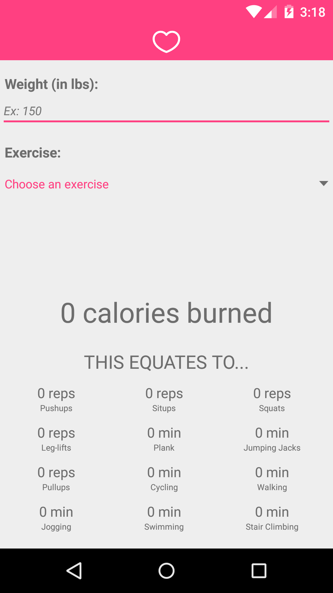
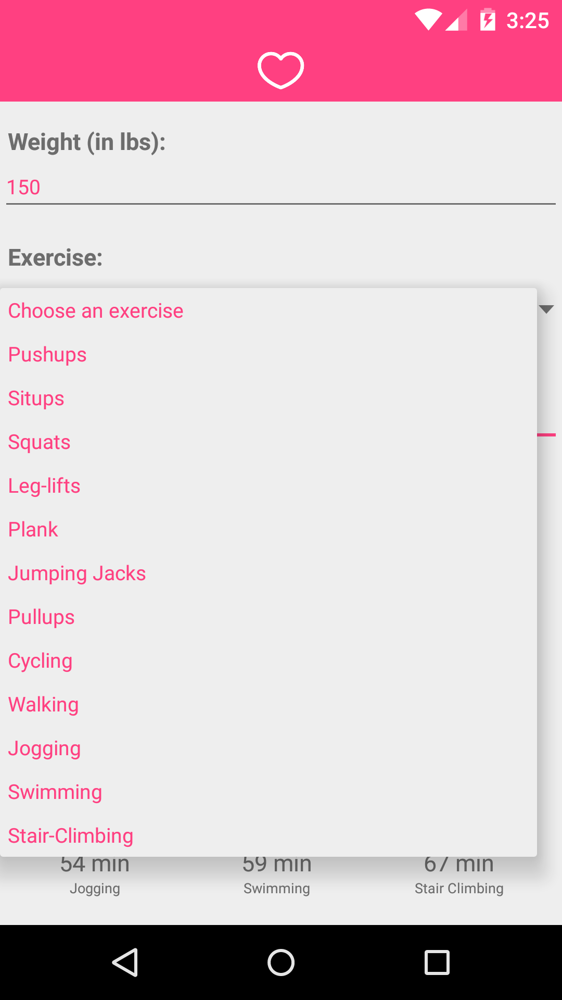
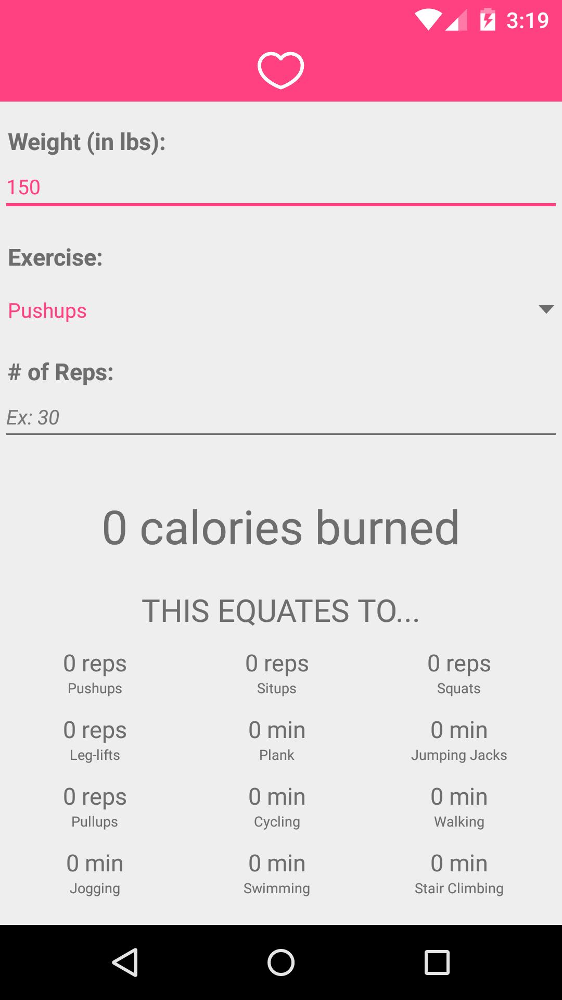
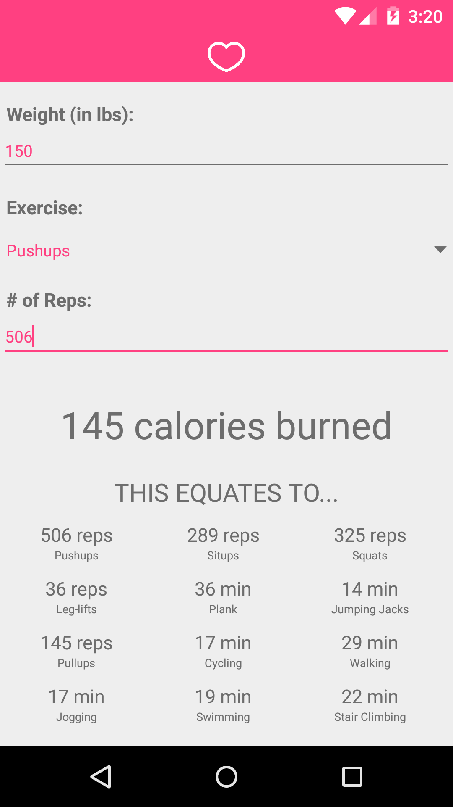
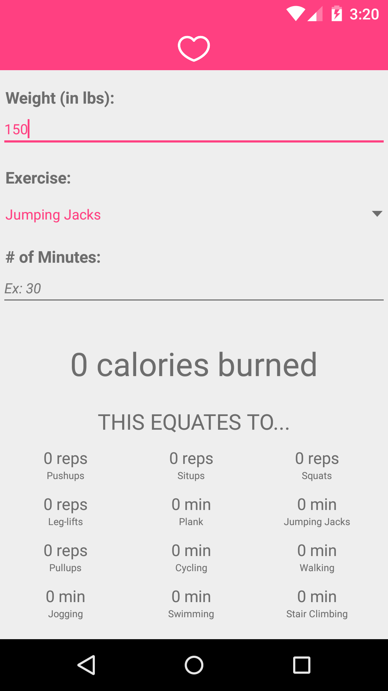
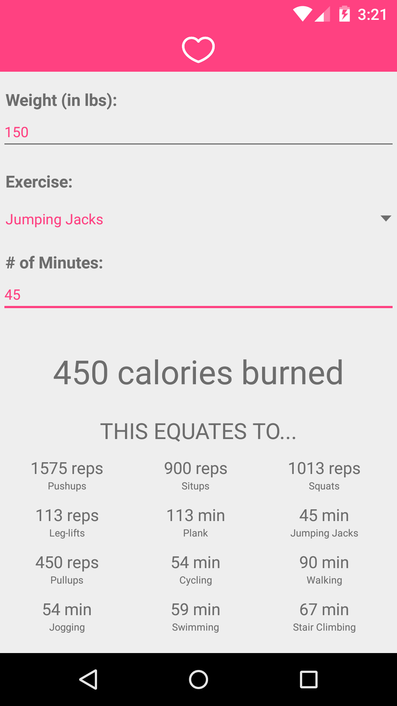

# PROG 01: Heart

Heart is a very simplistic and minimalistic app that will help you figure out how many calories you burned from your workout. Simply enter your weight (my implementation doesn't calculate calories based on weight), choose the exercise from a drop-down list, and specify how many reps or minutes you did. Without pressing any buttons, the converter will automatically show you how many calories you burned, and the equivalent of other exercises you will need in order to burn the same amount. If you decide you edit the exercise you did and/or the number of reps/minutes, the converter will automatically change according to your edit.

## Authors

Judy Wang ([judy.wang@berkeley.edu](mailto:judy.wang@berkeley.edu))

## Demo Video

See [your demo video title here] (https://link_to_your_video)

## Screenshots

## Acknowledgments

* Hat tip to anyone who's code was used
* Any other support

*Feel free to enhance your README. For Markdown syntax, see [the GitHub Guides](https://guides.github.com/features/mastering-markdown/). Remove this line in your submission.*
